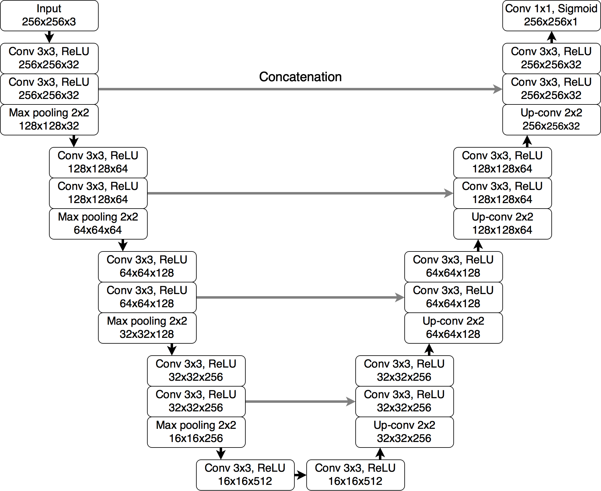

# brain-tumor-segmentation
A UNet model for brain tumor segmentation. Pytorch version. A web app to tune parameters.

### data source
https://www.kaggle.com/datasets/mateuszbuda/lgg-mri-segmentation

## Install Dependencies
run `pip install -r requirements.txt` in terminal 

## Unet

## Training Model

To train the model, run `train.py`:

## Make Prediction

To start the web app, run `streamlit run home.py` in terminal.

